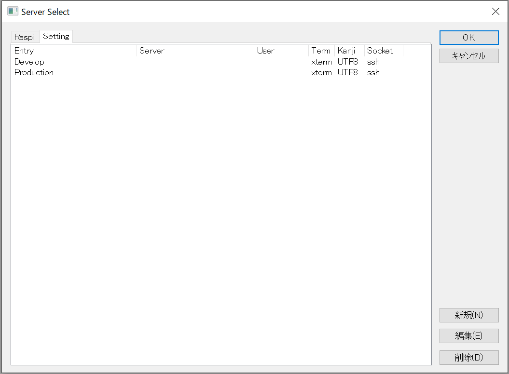
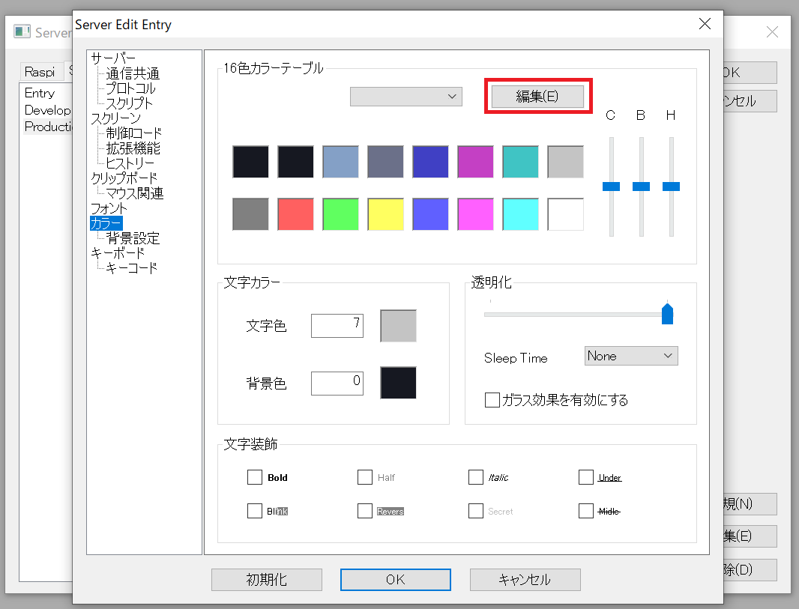
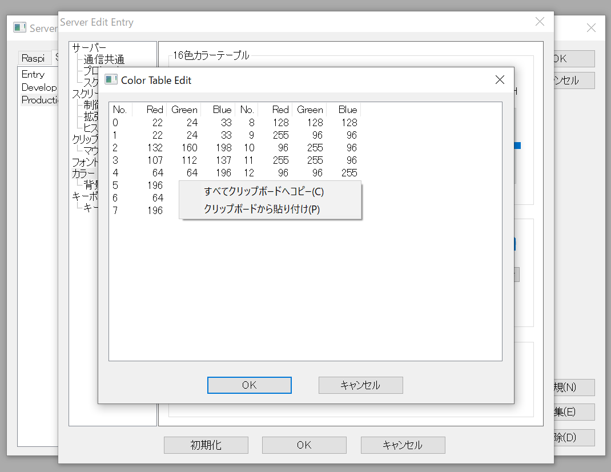

普段自分はRloginを使っていますが、カラースキームにicebergが無かったので
作成しました。

## なぜiceberg?
- かっこいいから
- つよつよエンジニアがつかってそう(偏見)

## icerbergとは
vim用に開発されたカラースキームで世界中から人気があります。
https://github.com/cocopon/iceberg.vim


## 導入方法
1. 設定用のエントリーを作成(タグも設定しておくと便利)

1. カラーの`編集`をクリック

1. 下記の数値をコピーして右クリックで貼り付け

```
22  24  33
22  24  33
132 160 198
107 112 137
145 172 209
149 196 206
192 202 142
173 160 211
233 137 137
210 212 222
233 177 137
255 255 255
137 184 194
198 200 209
180 190 130
160 147 199
226 120 120
255 255 255
198 200 209
226 164 120
```

これでRloginにicebergの導入完了です。
では良いターミナルライフを！